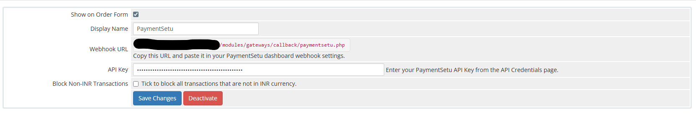
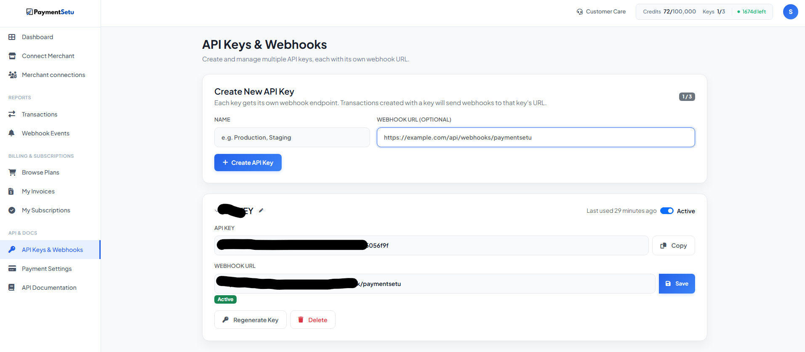
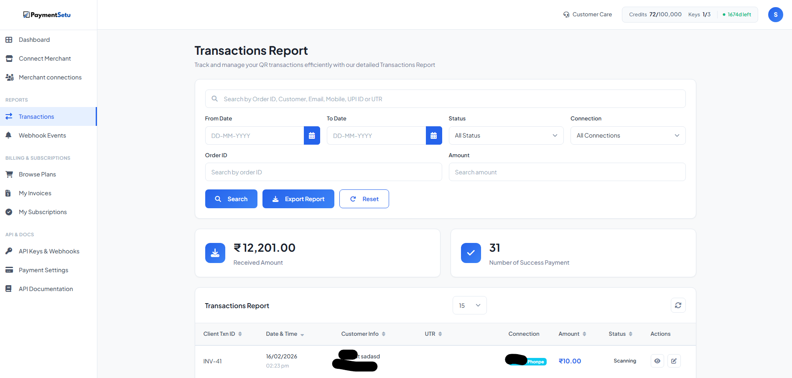

# PaymentSetu Payment Verification Module for WHMCS

[](https://paymentsetu.com)
[](https://www.whmcs.com)
[](https://github.com)

Accept UPI payments in your WHMCS billing system with PaymentSetu - India's leading payment verification platform.

> ### 💰 **Zero Transaction Fees! Pay Only a Fixed Monthly Charge & Keep 100% of Your Revenue**
> Unlike traditional payment platforms that charge per transaction, PaymentSetu offers a simple flat monthly subscription. **No hidden fees. No percentage cuts. Just unlimited verifications for one fixed price!**

---

## 🚀 Features

- ✅ **UPI Payments** - Accept payments via UPI QR codes
- ✅ **Easy Integration** - Simple setup in minutes
- ✅ **Automatic Webhook** - Real-time payment notifications
- ✅ **INR Currency Support** - Built for Indian businesses
- ✅ **Secure** - Industry-standard security practices

---

## 📋 Prerequisites

Before you begin, make sure you have:

1. A WHMCS installation (version 7.0 or higher)
2. Admin access to your WHMCS backend

---

## 🛠️ Installation Guide

Follow these simple steps to get started — from creating your PaymentSetu account to accepting your first payment.

### Step 1: Create a PaymentSetu Account

1. Go to [https://paymentsetu.com](https://paymentsetu.com)
2. Click on **Sign Up** and create your account
3. Complete the registration and log in to your dashboard

### Step 2: Download the Module

📦 **[Download paymentsetu-whmcs-module.zip (v1.1)](https://github.com/samratfkt/paymentsetu-whmcs/releases/download/v1.1/paymentsetu-whmcs-module.zip)**

### Step 3: Upload Files to WHMCS

#### ⚡ Quick Install (Recommended)

1. Upload the downloaded **`paymentsetu-whmcs-module.zip`** to your server
2. Extract the zip directly into your **WHMCS root directory**
3. The folder structure will align automatically — you're done with this step!

#### 🔧 Manual Install

If you prefer to upload files manually:

1. Extract the zip on your computer
2. Open your WHMCS installation folder on your server
3. Upload `paymentsetu.php` to the `modules/gateways/` folder
4. Upload `paymentsetu.php` from the `callback` folder to `modules/gateways/callback/`

**File Structure after extraction:**
```
whmcs/
└── modules/
    └── gateways/
        ├── paymentsetu.php
        └── callback/
            └── paymentsetu.php
```

### Step 4: Activate the Module in WHMCS

1. Log in to your WHMCS admin panel
2. Go to **Setup** → **Payments** → **Payment Gateways** *(WHMCS menu name)*
3. Click on the **All Payment Gateways** tab *(WHMCS menu name)*
4. Find **PaymentSetu** in the list and click on it
5. Check the box to **Activate** the module
6. You will now see the PaymentSetu settings page


*PaymentSetu configuration page in WHMCS admin panel*

### Step 5: Copy the Webhook URL from WHMCS

On the PaymentSetu settings page in WHMCS, you will see a **Webhook URL** displayed at the top.

1. The webhook URL will look like this:
   ```
   https://yourdomain.com/modules/gateways/callback/paymentsetu.php
   ```
2. **Copy this URL** — you will need it in the next step

> 💡 **Tip:** You can also access this page later by going to `/admin/configgateways.php` in your WHMCS installation.

### Step 6: Get Your API Key from PaymentSetu Dashboard

Now you need to register the webhook URL and generate your API key.

1. Go to [https://paymentsetu.com/developer/api-credentials](https://paymentsetu.com/developer/api-credentials)
2. Log in to your PaymentSetu account
3. You will see a form to **Create New API Key**

#### Fill in the form:

- **NAME:** Enter a name for this API key (e.g., "WHMCS Production" or "My WHMCS Store")
- **WEBHOOK URL (OPTIONAL):** Paste the webhook URL you copied from WHMCS in Step 5

4. Click the **Create API Key** button
5. Your API key will be generated automatically
6. **Copy the API key** — you will need it in the next step


*PaymentSetu dashboard showing API key and webhook management*

> ⚠️ **Important:** Keep your API key secure and never share it publicly.

### Step 7: Add API Key to WHMCS

Now return to your WHMCS admin panel:

1. Go back to **Setup** → **Payments** → **Payment Gateways** *(WHMCS menu name)*
2. Select **PaymentSetu** from the list
3. In the **API Key** field, paste the API key you copied from PaymentSetu
4. (Optional) Enable **Block Non-INR Transactions** if you only want to accept INR currency
5. Click **Save Changes**

---

## ✅ You're Done!

The PaymentSetu payment verification module is now active on your WHMCS system. Customers will see a "Pay Now" button on their invoices that redirects them to PaymentSetu's secure payment page.

---

## 💳 How It Works

1. Customer views an invoice in WHMCS
2. Customer clicks the **Pay Now** button
3. Customer is redirected to PaymentSetu's payment page
4. Customer scans the UPI QR code and completes payment
5. PaymentSetu verifies the payment and sends a webhook notification to WHMCS
6. Invoice is automatically marked as paid in WHMCS


*Transaction table in PaymentSetu dashboard showing payment history*

---

## 🔧 Configuration Options

| Option | Description |
|--------|-------------|
| **API Key** | Your PaymentSetu API key from the dashboard |
| **Webhook URL** | Auto-generated URL for receiving payment notifications |
| **Block Non-INR Transactions** | Enable this to only accept payments in Indian Rupees (INR) |

---

## 🆘 Troubleshooting

### Payment not updating in WHMCS?

1. Check that the webhook URL is correctly configured in your PaymentSetu dashboard
2. Verify that the API key in WHMCS matches the one in PaymentSetu
3. Check WHMCS logs: **Utilities** → **Logs** → **Module Log**

### Getting "Transaction Blocked" error?

- This means you are trying to pay an invoice in a currency other than INR
- Go to **Setup** → **Payments** → **Payment Gateways** *(WHMCS menu name)* → **PaymentSetu**
- Uncheck **Block Non-INR Transactions** to allow other currencies (not recommended)
- Or change your invoice currency to INR

### Cannot find PaymentSetu in the module list?

- Make sure you uploaded the files to the correct folders
- Check file permissions (644 for files, 755 for folders)
- Clear WHMCS cache

---

## 📞 Support

- **PaymentSetu Support:** Visit [https://paymentsetu.com/support](https://paymentsetu.com/support)
- **Documentation:** [https://paymentsetu.com/developer/api-credentials](https://paymentsetu.com/developer/api-credentials)

---

## 📄 License

This module is provided as-is for use with PaymentSetu payment verification services.

---

## 🔗 Links

- [PaymentSetu Website](https://paymentsetu.com)
- [Create PaymentSetu Account](https://paymentsetu.com)
- [API Credentials Dashboard](https://paymentsetu.com/developer/api-credentials)
- [WHMCS Documentation](https://docs.whmcs.com)

---

<div align="center">

**Made with ❤️ for WHMCS users**

[Get Started](https://paymentsetu.com) | [Documentation](https://paymentsetu.com/developer/api-credentials) | [Support](https://paymentsetu.com/support)

</div>
